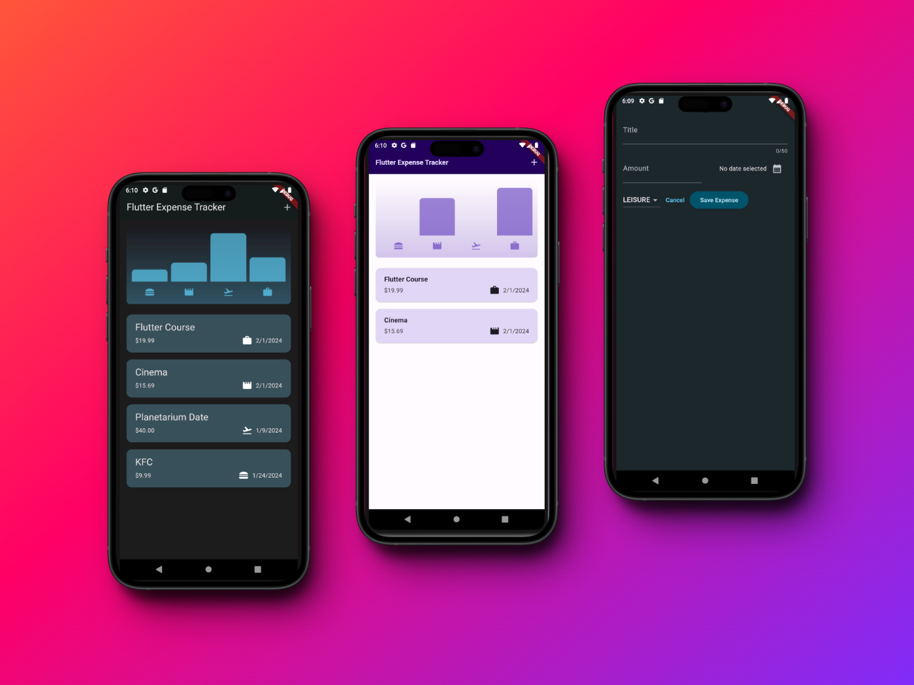

# Flutter Expense Tracker

## Overview

The Expense Tracker App is a user-friendly mobile application developed using Flutter, designed to help users manage and track their expenses efficiently. This app offers a convenient way to keep a close eye on your spending habits, categorize expenses, and maintain a better financial balance. Whether for personal use or managing household expenses, this app is an ideal companion for anyone looking to bring more organization to their financial life.

## Screenshots

## Features

### 1. Categorized Expense Chart
The app displays expenses in an easy-to-understand chart, breaking down spending into various categories such as leisure, work, entertainment, etc. This visual aid helps users quickly grasp where their money is going.
### 2. Detailed Expense Widgets
Each expense is meticulously logged with dedicated widgets that show the price and specific category of the expenditure. This feature aids in maintaining detailed records of where and how users spend their money.
### 3. Light and Dark Mode
Catering to user preferences and varying lighting conditions, the app includes both a light mode and a dark mode. Users can choose the theme that best suits their comfort or switch according to the time of day.
### 4. Easy Expense Input
The app simplifies the process of adding new expenses. Users can quickly input each expense, assign it to a category, and set the date. This streamlined process makes it easier to keep the expense record up-to-date.
### 5. Intuitive Design
With its intuitive design, the app ensures that tracking expenses is not only efficient but also enjoyable. The interface is designed to be straightforward, allowing for easy navigation and minimal learning curve for new users.

## Acknowledgements

This project was inspired by the course ["Learn Flutter & Dart to Build iOS & Android Apps"](https://www.udemy.com/course/learn-flutter-dart-to-build-ios-android-apps/) by Academind by Maximilian Schwarzmüller. The course was instrumental in providing a solid foundation in Flutter app development.
